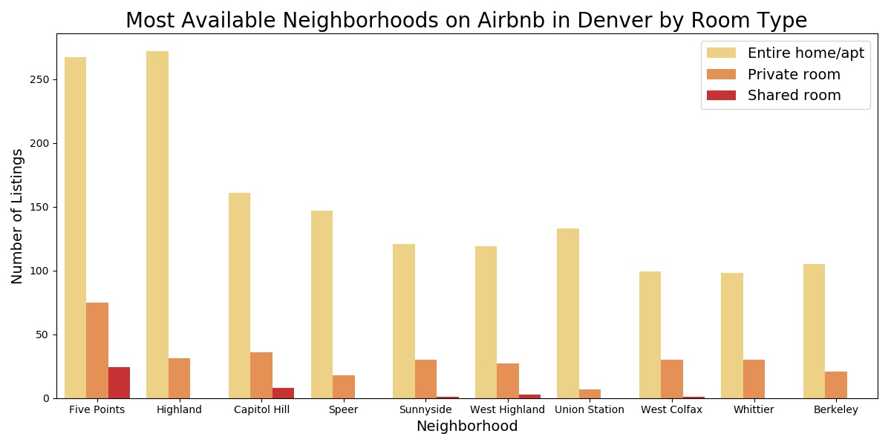
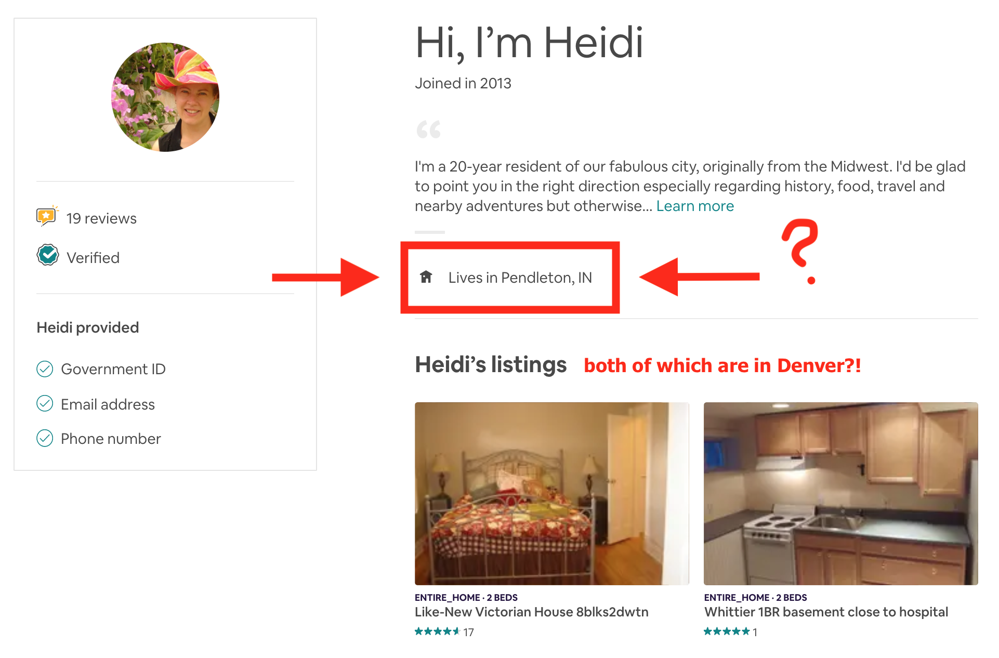

## Airbnb in Denver: This is Why We Can't Have Nice Things
### Sarah Forward

Background
------
I have been an Airbnb host in Denver for the last year and half. It's been a great source of mostly passive income and about 95% of our guests are pretty easy going. When I first discovered the data, I was interested in finding out:
+ Does the listing description and length increase number of bookings? 
+ What's the ratio of Superhosts to total Airbnb listings in Denver? 
+ Similar to optimizing SEO on websites, do hosts pack in Denver's things-to-do every chance they get?
    * For example, I live in Sloan's Lake and two blocks from Mile High Stadium. That's included in both our listings, but I also let guests know we're a shared-ride away from RiNo, LoHi, Coors Field, 16th Street Mall, the Convention Center, etc. any where I can. 
+ There's a section called "Getting Around" on every listing where hosts can tell guests what kind transportation options are available around the area. What are hosts telling guests? More Uber mentions or Lyft? Are they proponents of the Light Rail? 
+ What's the Airbnb utilization per neighborhood? And learning how to map that visually.

But what started out to be a project to see how I could maximize and make the most from my Airbnb listings quickly turned into a compliance investigation after finding out where the data came from and digging into the actual data myself. 

Data Description
------
Murray Cox is an Austrailian-native-turned-New-York-transplant who runs [Inside Airbnb](http://insideairbnb.com/about.html) - "an independent, non-commercial set of tools and data that allows you to explore how Airbnb is really being used in cities around the world."

He's been scraping publicly available data on Airbnb from more than 100 cities around the world. You can get listings, calendar dates and availability, and reviews for cities like Amsterdam, Barcelona, Cape Town, Hong Kong, and, of course, Denver. 

He considers himself a "housing activist" but the media has dubbed him “Airbnb’s global public enemy No. 1" after publishing his first report in 2016 describing in detail how Airbnb and its hosts were violating New York state law. New York's dwelling law at the time stated that "an apartment with three or more units cannot be rented out for under 30 days unless there's a permanent occupant present." So, if one host is listing multiple apartments - they couldn't possibly be living in *all of them*.  

In December 2015, [Airbnb released a report](https://www.nytimes.com/2015/12/02/technology/airbnb-releases-trove-of-new-york-city-home-sharing-data.html?module=inline) around its presence in New York City in an effort to be more transparent. And that backfired just two months later.

It turns out Cox would regularly update his numbers from as early as 2014. When comparing his data to that of Airbnb's he noticed that there were large chunks of listings missing just before Airbnb released their report. More specifically, it was missing listings that featured Airbnb hosts who were listing multiple apartments and in clear violation of New York's dwelling law. 

Cox and another collaborator, Tom Slee, compiled [a comprehensive report](http://insideairbnb.com/reports/how-airbnbs-data-hid-the-facts-in-new-york-city.pdf) calling out Airbnb for trying to sweep the known violations under the rug. Naturally, Airbnb tried to deny the claims saying that it was "a natural fluctuation — a comedown off of the frenzy of the New York City marathon and Halloween weekend." It was until two weeks later that Airbnb sent a letter to New York state legislators and users admitting that the report was true. 

(New) Capstone 1 Goals
------
+ Getting more comfortable using pandas and sifting through large data.
+ Transition from Jupyter Notebooks into using code editor, Visual Studio Code.
+ Cox stated in [this article from 2016](http://insideairbnb.com/nyc-the-war-against-commercial-listings-continues/) that "Airbnb's business model incentivizes commercial use, regardless of whether it is one host that permanently rents multiple homes, or many hosts that permanently rent one entire home." Is this still true and is it happening in Denver?
+ Finding hosts with multiple listings that could be in possible violation of Denver's short-term rental regulations & licensing.
+ Making my code easily transferrable to the other cities *Inside Airbnb* features.

Describing the Data
------
The snapshot data for Denver and other cities can be found on [Inside Airbnb](http://insideairbnb.com/get-the-data.html). It seems to be updated every month or so. Data from previous months are archived and linked below the city's current data sets.

I reviewed the following .CSV files:
+ Listings
+ Calendar
+ Reviews

Exploration highlighted:
+ **Listings**
    * There are 4,511 total Airbnb listings in Denver across 78 neighbourhoods.
        * 73% - Entire Home/Apt
        * 25% - Private rooms
        * 2%  - Shared rooms
    * Of the 106 columns, these are the 27 I decided to keep:

```python
        List of columns to keep
        =============
        id                          latitude                    space
        host_id                     longitude                   description
        host_listings_count         minimum_nights              transit 
        neighbourhood               maximum_nights              access
        neighbourhood_cleansed      minimum_nights_avg_ntm      interaction
        property_type               maximum_nights_avg_ntm      host_url
        room_type                   requires_license            listing_url
        price                       license
        weekly_price                name
        monthly_price               summary
        =============
```

* There's a designated section where hosts are to enter their license number. This is when I realized I put our license number in the wrong spot and quickly fixed our listings.
* A *neighbourhood_cleansed* column correctly converts the listing's neighbourhood to be representative of the city's neighbourhood boundaries.
    * **Host entered**: LoDo (Lower Downtown) -> **Becomes**: Union Station
    * **Host entered**: RiNo (River North)    -> **Becomes**: Five Points
* Property types could be:
    * Guesthouse
    * Loft 
    * House
    * Apartment
    * Bed and breakfast
    * Guest suite
    * Cottage
    * Townhouse
    * Condominium
    * Bungalow
    * Serviced apartment
    * Tiny house
    * Castle
    * Other
    * Hostel
    * Villa
    * Camper/RV
    * Tent
    * Campsite
* Room type options are:
    * Entire home/apt
    * Private room
    * Shared room

+ **Calendar**
    * Total rows = 1,646,515 
    * The data set featured bookings from June 29, 2019 through June 27, 2020. 
    * A categorical column with True/False values distinguished if the listing was booked or not.
   
+ **Reviews**
    * Total rows = 221,847
    * Information included:
        * Listing ID
        * Date
        * Reviewer ID
        * Reviewer Name
        * Comments

Data Visualization + Discovery
------
First I wanted to see what neighborhood in Denver had the most Airbnb listings to choose from.  
 

___

My next question: Of these neighborhoods, what are the room types that are listed?


___

I started to pull the information on "entire home/apt" listings in Five Points, but then I went down a few rabbit holes.

**A few things to note about the City and County of Denver's short-term rental regulations**:
+ To host on Airbnb, you need to apply for a short-term-rental license that costs $25.
+ If you don’t own the house, you need the landlord or property owner’s approval.
+ Unit must be Licensee’s primary residence.
    * Or else [this](https://www.denverpost.com/2019/06/11/denver-short-term-rental-airbnb-arrest/) and [this](https://www.denverpost.com/2019/09/04/airbnb-denver-short-term-rentals/) happens.
+ Licensee must list the unit’s STR license number on any online, print or other advertisements.
+ Accessory dwelling units (ADUs) can be used for STRs, but only one STR license can be granted per Primary Resident's property.

___

After combing through the calendar.CSV looking to see what columns to keep and update before merging into the listing.CSV, I came across a listing that has a maximum night availability of 1125 days. That's a little over 3 years.


Say "Hello!" to Heidi. I think she's new here. She has [two Airbnb listings](airbnb.com/users/show/7961490) in Denver, one in Whittier and the other in Five Points, that she rents from good ol' Pendleton, Indiana.



Future Directions
------
I'm fully invested in finding out how to weed out the Airbnb hosts who are violating Denver's short-term rental agreement. Some things I need to consider are:
+ Making sure the listing is within the City and County of Denver. I've come across a few listings in Lakewood and other areas that are not within Denver City Limits.
+ Finding out how likely an entire home/apt is to be violating the law. Just because a person is listing out their entire home does not mean they're not actually living there. Like [Julie](https://www.airbnb.com/users/show/1496) who offers a room in her house while also having the option to rent the *whole* house. 
+ When running through the "license" column, double checking to see if they've entered their license number in another description on their listing... like I did at first. 

References
------

Carville, Olivia. (2019, March). *Meet Murray Cox, The Man Trying to Take Down Airbnb.* https://www.bloomberg.com/news/articles/2019-05-23/meet-murray-cox-airbnb-s-public-enemy-no-1-in-new-york

Denver's Short-Term Rental Regulations & Licensing
https://www.denvergov.org/content/denvergov/en/denver-business-licensing-center/business-licenses/short-term-rentals/short-term-rental-faq.html

Issac, Mike. (2015, December). *Airbnb Releases Trove of New York City Home-Sharing Data* https://www.nytimes.com/2015/12/02/technology/airbnb-releases-trove-of-new-york-city-home-sharing-data.html?module=inline

Katz, Miranda. (2018, February). *A Lone Data Whiz Is Fighting Airbnb — and Winning.* https://www.wired.com/2017/02/a-lone-data-whiz-is-fighting-airbnb-and-winning/